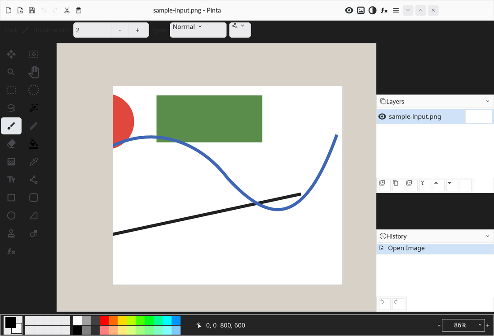

# pinta-rs



`pinta-rs` is a Rust + Iced mock port of Pinta, built side-by-side with the upstream C# / GTK application to drive visual and behavioral parity work.

## Current Status

- The mock app reproduces the main Pinta shell, toolbox, canvas scene, layers/history pads, and status bar.
- The current screenshot in this README is generated locally from the running mock using `spectacle`.
- The paired upstream workspace was instrumented with diagnostics and screenshot hooks so the Rust mock can be compared against a real Pinta build instead of guessing from static screenshots.
- Version `0.1.11` is the current workspace release snapshot, published through GitHub Releases rather than checked-in release artifacts.

## Release 0.1.11

- Git tag: `0.1.11`
- Release distribution: GitHub Releases for this repository
- Resume notes for future LLM sessions: `VIBE_NOTES.md`

## LLM Used

This workspace was developed with GitHub Copilot using GPT-5.4.

The model was used for:

- architecture planning for a Rust + Iced Pinta port,
- local repository scaffolding,
- upstream Pinta diagnostics instrumentation,
- screenshot capture and comparison tooling,
- iterative visual parity passes based on generated artifacts.

## Upstream Pinta Diagnostics Work

The workspace also includes a local checkout of upstream Pinta in a sibling directory, used as the reference implementation:

- upstream app: `../pinta-upstream`
- sample input image: `../sample-input.png`

The upstream C# application was extended with opt-in diagnostics hooks for inspection and screenshot capture. The important pieces are:

- startup and activation diagnostics in `Pinta/Main.cs`,
- session logging, widget-tree dumps, widget lookup, window capture, and canvas crop generation in `Pinta/Diagnostics.cs`,
- runtime compatibility fallback for texture capture in `Pinta.Core/Extensions/Cairo/CairoExtensions.Samples.cs`.

Those hooks provide:

- structured startup/session logs,
- widget tree snapshots,
- main-window screenshots,
- exact canvas bounds,
- cropped canvas PNG artifacts for parity work.

## Linux Setup

The commands below cover the current local workflow on Linux.

### Base Dependencies

```bash
sudo apt-get update
sudo apt-get install -y \
  build-essential \
  pkg-config \
  curl \
  git \
  python3 \
  python3-pil \
  imagemagick \
  spectacle \
  libgtk-4-dev \
  libadwaita-1-dev \
  libxkbcommon-dev \
  libwayland-dev \
  libx11-dev \
  libasound2-dev \
  mesa-utils \
  libgl1-mesa-dev
```

### Rust Toolchain

```bash
curl https://sh.rustup.rs -sSf | sh
source "$HOME/.cargo/env"
rustup default stable
```

### .NET SDK For Upstream Pinta

```bash
sudo apt-get install -y dotnet-sdk-10.0
```

## Running pinta-rs

```bash
cd pinta-rs
cargo check
cargo run
```

If your Linux graphics stack needs it, force the backend used in this workspace:

```bash
cd pinta-rs
WGPU_BACKEND=gl cargo run
```

## Capturing A Mock Screenshot

```bash
cd pinta-rs
./tools/capture_mock.sh
```

That writes a timestamped PNG to `captures/`.

## Building And Running Upstream Pinta With Hooks

```bash
cd pinta-upstream
dotnet build Pinta.sln
PINTA_DIAGNOSTICS_DIR=$PWD/diagnostics dotnet run --project Pinta -- --debug ../sample-input.png
```

The latest reference capture session currently used for comparison is under:

- `../pinta-upstream/diagnostics/20260419-230608/`

## Comparing Mock vs Upstream

The canonical parity workflow is the bundle script below. It captures a full upstream window and a full mock window into the workspace root, refreshes both diagnostics session folders, and rebuilds the control comparison bundle.

```bash
cd pinta-rs
./tools/capture_parity_bundle.sh
```

That refreshes:

- `../pinta-upstream-window.png`
- `../pinta-rs-window.png`
- `../pinta-window-side-by-side.png`
- `../pinta-window-diff.png`
- `../pinta-window-metric.txt`
- `../pinta-upstream-reflection/`
- `../pinta-rs-diagnostics-output/`
- `../ui-control-comparisons/`

For a narrower legacy diff against one specific capture pair, the older compare script is still available:

```bash
cd pinta-rs
MOCK_PATH="$(./tools/capture_mock.sh)"
./tools/compare_with_upstream.sh \
  ../pinta-upstream/diagnostics/20260419-230608/capture-004-main-window-spectacle.png \
  "$MOCK_PATH"
```

That produces:

- normalized upstream and mock PNGs,
- a side-by-side comparison image,
- a diff image,
- an RMSE metric.

## Workspace Layout

```text
pinta-rs/
├── crates/
│   ├── pinta-app/
│   ├── pinta-theme/
│   └── pinta-ui/
├── docs/readme/
├── tools/
├── captures/
└── compares/
```

## Notes

- This repository is currently a parity-oriented mock and tooling workspace, not a full editor implementation.
- The upstream C# application remains the behavior reference.
- The Rust workspace exists to explore what a Pinta port could look like in Rust + Iced while keeping the iteration loop grounded in local captures.